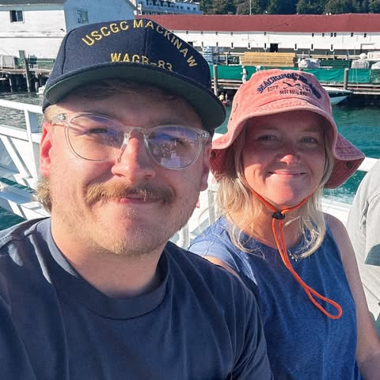
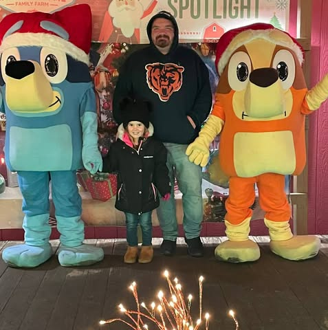

=== block

::: facts
- **Coordinators** - Planning
- **House Band** — *The Turnups*
- **Guest Band** — Local/regional bands you might see at a jam
- **Regulars** — Folks you are likely to see at a jam
- **Sponsors** — Organizations backing the jams
:::

=== block

## Venue and Coordination

::: cards
-  **Nate Miller** — Jam Coordinator - If you're walking into the Jam, talk to Nate during the setup/signup times,
he'll get you a slot.
- **Caselle Brennae** — Venue Coordinator
:::

=== block

^ The House Band

## *The Turnups*

The event leverages a house band to anchor the night:

::: list
- Kick off with varied set
- Provide backing instruments for walk-in open jams
:::

::: cards
-  **Nate Miller** — Bassist, Trumpet, Guitar
-  **Jacob Hilbrich** — Guitar, Keys, Sax, Drums
-  **Luke Porter** — Drums, Guitar
-  **Josh Andrews** — Guitar, Bass, Drums
:::

These guys are working and accomplished musicians.
They can play with experienced musicians, while also being able to guide less experienced musicians during the jams.

=== block

^ Local or regional acts that might sit in from time-to-time...

## Guest Bands

TBD

=== block

^ Who you're likely to see every week...

## Regulars

TBD

=== block

^ Who you're likely to see every week...

## Sponsor Organizations

Special thanks to the following:

::: list
- **Shoreline**: They provide the venue, the PA system, great food, service, customers and vibe.
- **Roxy Music**: [Roxy Music](https://www.roxymusic.com/) is a local music shop in LaPorte, Indiana.
Nate, Jacob and Luke from the house band work and teach at Roxy.  It is common to see their students perform at the Jam.
:::
